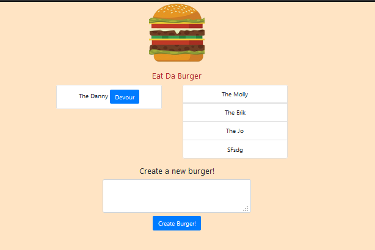

# Eat-Da-Burger!

## Description 

This application allows a user to create a new burger that will appear in the left column and devour it to move it to the right column

## Table of Contents

* [Usage](#usage)
* [License](#license)
* [Questions](#questions)

## Usage 

To use this app go to https://ejbrownlf-burgers.herokuapp.com/

In the bottom text area write the name of your new burger and it will appear in the left hand column along any other burgers in that list with a button that says devour. Click the devour button and it will move the right hand column and stay with all burgers that have been devoured.

Link to my portfolio: https://ejbrownlf.github.io/pages/portfolio.html

# License

This project is covered by the [MIT](https://opensource.org/licenses/MIT) License

# Questions

Here is a link to my [Github](https://github.com/ejbrownlf)

You can reach me by emailing me here at ejbrownlf@gmail.com

